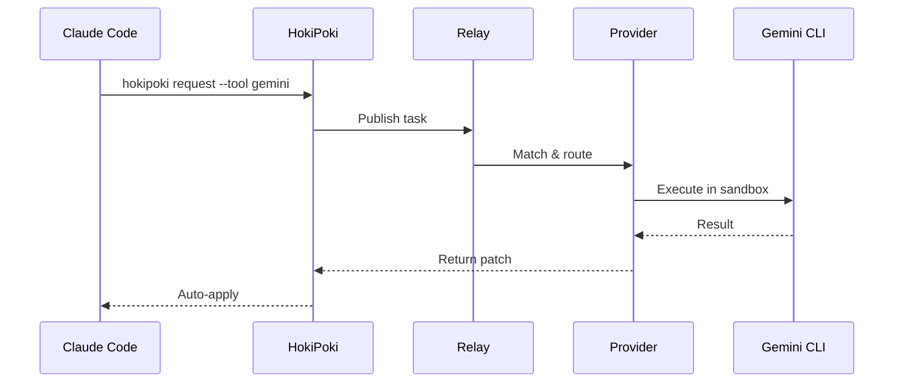
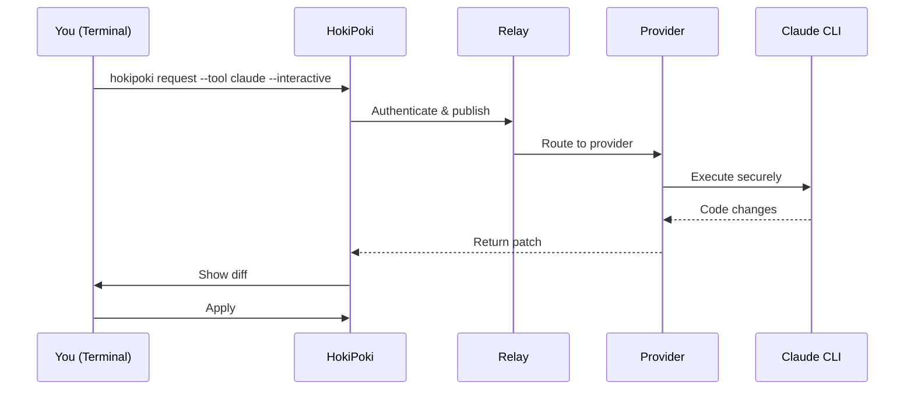
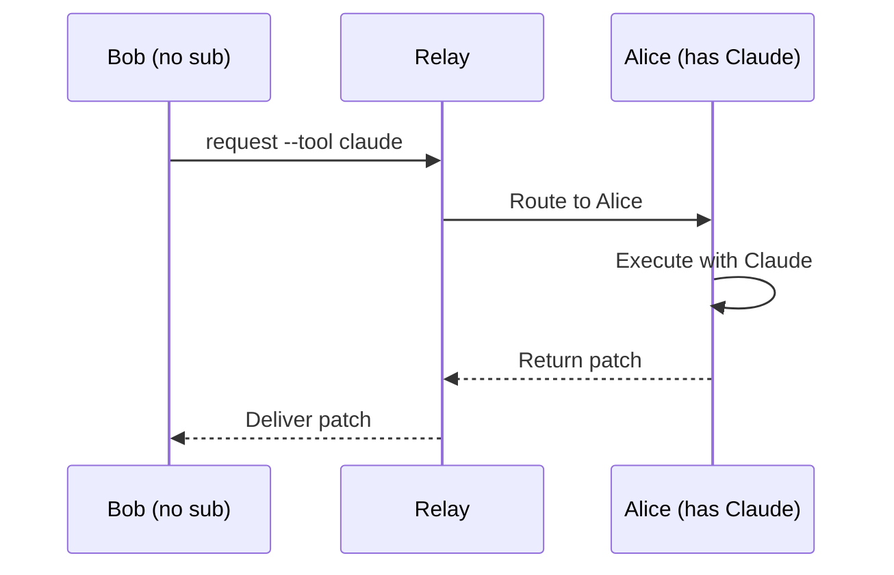

<p align="center">
  
</p>

# HokiPoki CLI

> Switch models, not tabs. When your AI gets stuck, hop to another.

**Stop paying for every AI CLI.** Keep one subscription and hop to other models when yours gets stuck, drifts, or loses context.

## Why HokiPoki?

Every new AI CLI launch comes with hype posts ("this changes everything!"), and suddenly you're juggling Claude, Codex, Gemini subscriptions just to stay current.

But here's the thing: **different models excel at different tasks**. Claude might nail your architecture decisions while Codex crushes boilerplate generation. Instead of paying for both, why not share?

HokiPoki lets you:
- **Hop between models** when one gets stuck - different AIs solve different problems better
- **Try before you buy** - invite a friend to your workspace and test their AI CLI instantly
- **Share with teammates** - pool your AI CLIs (keys stay local, only encrypted requests/results are routed)
- **Cut subscription costs** - use what you have, borrow what you need

## Prerequisites

- **Node.js** 18+
- **Docker** (required for secure task execution)
- **Git**
- **HokiPoki account** - Sign up at [hoki-poki.ai](https://hoki-poki.ai)

## Installation

```bash
npm install -g @next-halo/hokipoki-cli
```

## Quick Start

```bash
# 1. Login to your account
hokipoki login

# 2. Request help from an AI tool (pick one approach):

# Option A: Include specific files
hokipoki request --tool claude --task "Fix the bug in auth logic" --files src/auth.ts src/utils.ts

# Option B: Include entire directories
hokipoki request --tool codex --task "Add error handling" --dir src/services/

# Option C: Include your whole project (respects .gitignore)
hokipoki request --tool gemini --task "Review code for security issues" --all

# 3. That's it! The result will be applied automatically as a patch
```

## Commands

### Authentication

```bash
hokipoki login      # Authenticate with your account
hokipoki logout     # Remove local authentication
hokipoki whoami     # Show current user info
```

### Request Help (Requester)

```bash
hokipoki request --tool <tool> --task "<description>" [options]
```

**Options:**
| Option | Description |
|--------|-------------|
| `--tool <tool>` | AI tool to use (claude, codex, gemini) |
| `--task <task>` | Task description |
| `--files <files...>` | Specific files to include |
| `--dir <directories...>` | Directories to include recursively |
| `--all` | Include entire repository (respects .gitignore) |
| `--no-auto-apply` | Don't auto-apply patches, just save them |
| `--json` | Output as JSON for programmatic use |

**Examples:**

```bash
# Fix a bug in specific files
hokipoki request --tool claude --task "Fix the memory leak" --files src/cache.ts

# Refactor an entire directory
hokipoki request --tool codex --task "Add TypeScript types" --dir src/

# Get help with the whole project
hokipoki request --tool gemini --task "Review for security issues" --all
```

### Provide Your Tools (Provider)

Share your AI subscriptions with your team or the network:

```bash
# Register as a provider (one-time setup)
hokipoki register --as-provider --tools claude codex gemini

# Start listening for requests
hokipoki listen --tools claude codex
```

**How authentication works:**

| Command | What it does |
|---------|--------------|
| `register --tools claude codex` | Opens browser for each tool, stores tokens, registers with backend |
| `listen --tools gemini` | Checks gemini token only → opens browser if expired |

**Token sources:**

| Tool | Auth Command | Token Location |
|------|--------------|----------------|
| Claude | `claude setup-token` | HokiPoki cache (`~/.hokipoki/`) |
| Codex | `codex login` | `~/.codex/auth.json` |
| Gemini | `gemini` | `~/.gemini/oauth_creds.json` |

**Auto-refresh:** When running `listen --tools <tool>`, if a token is expired or missing, HokiPoki automatically triggers the appropriate auth command (opens browser). You don't need to run `register` again unless you're adding new tools to the backend database.

### Account & Status

```bash
hokipoki status      # Check account info
hokipoki dashboard   # Open web dashboard
```

### Shell Completion

Enable tab completion for commands, options, and tool names:

```bash
# One-time setup
hokipoki completion --install

# Restart your shell
exec $SHELL

# Now use tab completion!
hokipoki req[TAB]                    → hokipoki request
hokipoki request --tool claude:[TAB] → shows sonnet, opus
```

Supports: Bash, Zsh, Fish

## Supported AI Tools

- **Claude Code CLI** (Anthropic)
- **Codex CLI** (OpenAI)
- **Gemini CLI** (Google)

## How It Works

### Use Case 1: AI-to-AI (Your AI calls another AI)

When Claude Code gets stuck, have it call Gemini or Codex for help:



### Use Case 2: Human Terminal (You request directly)

Run HokiPoki from your terminal to get help from any AI tool:



### Use Case 3: Workspace (Share one subscription with your team)

One person with Claude Max can serve their entire team:



**Result**: Bob uses Alice's Claude subscription. Team shares one subscription.

## Security

All task execution happens in isolated Docker containers with:
- Read-only filesystem
- Memory-only workspace (tmpfs)
- No shell access
- Automatic cleanup after completion

Your API keys never leave your machine. Providers only share compute, not credentials.

## Help

```bash
hokipoki --help              # General help
hokipoki <command> --help    # Command-specific help
```

## Tips & Tricks

### Interactive vs AI Mode

- **Human usage (terminal)**: Use `--interactive` flag when running HokiPoki directly from your terminal
  ```bash
  hokipoki request --tool claude --task "Fix bug" --files src/main.ts --interactive
  ```
- **AI CLI usage**: Don't use `--interactive` - causes hang/timeout. AI mode is auto-detected (non-TTY = AI mode). Patches auto-apply and results are returned in parseable format.

### Prerequisites for Auto-Apply

For patches to auto-apply successfully:

1. **Directory must be a git repository** - run `git init` if needed
2. **Target files must be committed** - run `git add . && git commit -m "initial"` first
3. Without these, patches are saved but NOT auto-applied

### Codex CLI Sandbox Configuration

Codex sandbox blocks `.git/` writes by default, preventing auto-apply. To fix, add to `~/.codex/config.toml`:

```toml
[sandbox_workspace_write]
writable_roots = [".git"]
```

## Links

- Website: [hoki-poki.ai](https://hoki-poki.ai)
- Support: office@next-halo.com

## License

MIT
